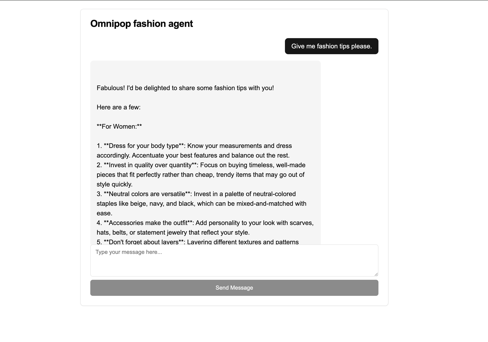

# Omnipop-agennt-frontend

A simple, Next.js frontend application for the Omnipop agents to interact with directly.



## Features

- 💬 Real-time chat interface with OpenAI models
- 🔄 Streaming responses for a natural conversation flow
- 🔒 Client-side API key configuration (no server storage)
- 📱 Fully responsive design
- 🎨 Clean, modern UI with Tailwind CSS and shadcn/ui
- ⚙️ Customizable API endpoint support

## Technologies Used

- [Next.js](https://nextjs.org/) - React framework
- [AI SDK](https://sdk.vercel.ai/) - AI integration toolkit
- [Tailwind CSS](https://tailwindcss.com/) - Utility-first CSS framework
- [shadcn/ui](https://ui.shadcn.com/) - UI component library
- [OpenAI API](https://openai.com/api/) - AI model provider

## Getting Started

### Prerequisites

- Node.js 18.x or later
- npm or yarn
- [Gaia API key](https://www.gaianet.ai/setting/gaia-api-keys)

### Installation

1. Clone the repository:

```bash
git clone https://github.com/yourusername/ai-chat-assistant.git
cd omnipop-frontend
```

2. Install dependencies:

```bash
pnpm install
```

3. Setup environment variables (check .env.example):

```bash
GAIA_API_KEY=
GAIA_BASE_URL=
GAIA_MODEL=
```
